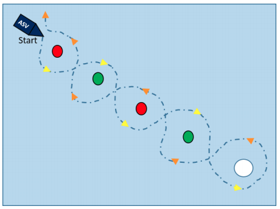
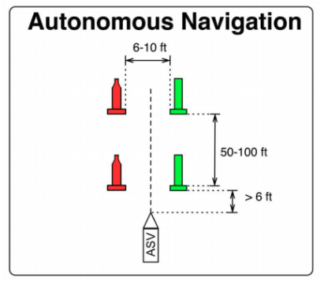
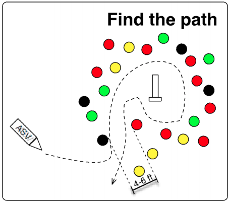

## Computer Vision and A.I. - VantTEC 

# Detection and Tracking on Aquatic Surfaces

## ROS_VANTTEC

<p align="center"> </p>

# Retos RoboBoat

## Introductorios 

### 1. Maintain Heading 

<p align="center"> </p>

### 2. Slalom Maneuver

<p align="center"> </p>

## Navegacion autonoma

<p align="center"> </p>

## Misiones

### 1. Speed Challenge

<p align="center"> </p>

### 2. Raise the flag

<p align="center"> </p>

### 3. Find the path 

<p align="center"> </p>

### 4. Follow the leader

<p align="center"> </p>

Referencias
```
@article{redmon2016yolo9000,
  title={YOLO9000: Better, Faster, Stronger},
  author={Redmon, Joseph and Farhadi, Ali},
  journal={arXiv preprint arXiv:1612.08242},
  year={2016}
}

@article{yolov3,
  title={YOLOv3: An Incremental Improvement},
  author={Redmon, Joseph and Farhadi, Ali},
  journal = {arXiv},
  year={2018}
}
```
