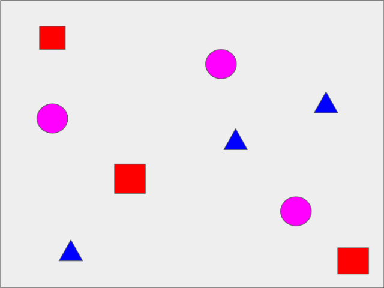
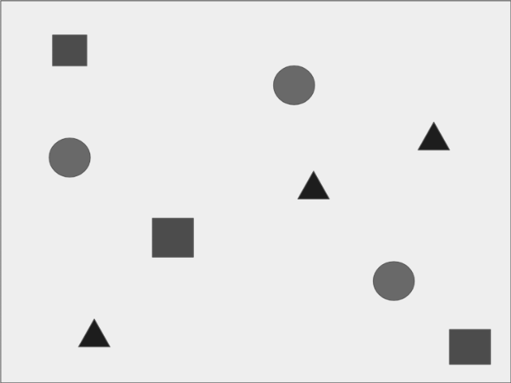
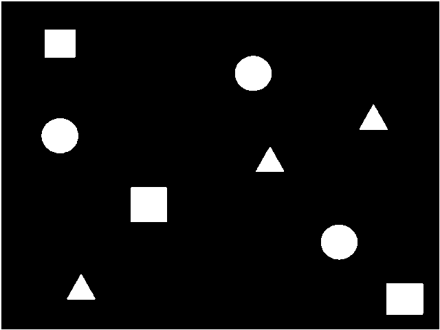
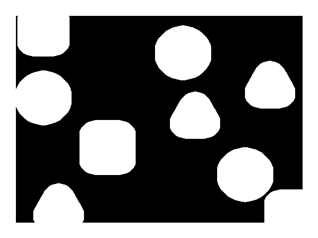
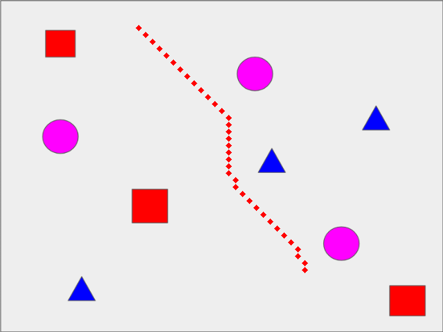

# Path planning 

This repository contains:
- A C++ implementation of the A* algorithm for path planning. 

## Prerequisites

```
	- Eigen3
	- Boost
	- OpenCV 3.4 
```

## Process (example)

### 1. Ground Annotator

Compile

```
	mkdir & cd build
	cmake ..
	make 
```

To test if it works, run the following command:
```
	cd $ROBOT_ROOT/build
	./astar
```

#### Testing

First, provide input map (default is $ROBOT_ROOT/maps/map1.png):
<p align="center">  </p>

Then, the algorithm converts the map to grayscale: 
<p align="center"> </p>

Then, the grayscale image is binarized:
<p align="center"> </p>

And morphological filters are applied to reduce risk of obstacle collision: 
<p align="center"> </p>

Next, an ocuppancy grid is generated and user sets source and destination:
<p align="center"> </p>

Finally, the algorithm computes a trajectory:
<p align="center"> </p>
