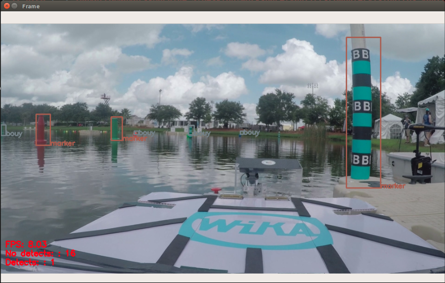

# VantTEC-ROS
### Sistema de vision barco para la "International RoboBoat Competition"

## Requerimientos
- OpenCV 3.4+
- Python2.7 o Python3.5
- ROS Kinetic
- Ubuntu 16.04 


## Configurar ambiente en ROS (bash)
```
	source /opt/ros/kinetic/setup.bash
	mkdir -p ros_vanttec/src
	cd ros_vanttec
	catkin_make
	source devel/setup.bash
```

Ejemplo para crear paquete en ambiente
```
	roscd ~/ros_vantec/src
	catkin_create_pkg detect roscpp rospy std_msgs cv_bridge
```

Para incluir opencv3, en el CMakeLists.txt que se encuentra en el paquete detect agregar lo siguiente:
```
	find_package(OpenCV 3 REQUIRED)
	include_directories(${OpenCV_INCLUDE_DIRS})
```

Finalmente, ejecutar:
```
cd ~/ros_vanttec
catkin_make
```

## Correr ROS
Dentro de la carpeta ros_vanttec, ejecutar: 
```
	roscore
```
En otra terminal, si es necesario re-compilar ejecutar:
```
	catkin_make
	source devel/setup.bash
```

# Detector Node
En una terminal nueva, ejecutar:
```
	rosrun detect detector_node.py --config vanttec/config/yolov3-vantec.cfg --weights vanttec/weights/yolov3-vantec.weights --classes vanttec/obj.names --video vanttec/video.mp4
```

# Color detector Service
En una terminal nueva, ejecutar:
```
	rosrun detect color_detector_service.py
```

Ejemplo de resultado:
<p align="center"> </p>

## Referencias
```
	@article{redmon2016yolo9000,
	  title={YOLO9000: Better, Faster, Stronger},
	  author={Redmon, Joseph and Farhadi, Ali},
	  journal={arXiv preprint arXiv:1612.08242},
	  year={2016}
	}

	@article{yolov3,
	  title={YOLOv3: An Incremental Improvement},
	  author={Redmon, Joseph and Farhadi, Ali},
	  journal = {arXiv},
	  year={2018}
	}
```

## TO DO:
- [x] Nodo de deteccion
- [x] Servicio para reconocimiento de color
- [x] Unir detector + color
- [ ] Corregir formato del codigo
- [ ] Update readme
- [ ] Nodo de tracking 
- [ ] Nodo para webcams
- [ ] Nodo de estimacion de distancias
- [ ] Nodo de deteccion de numeros