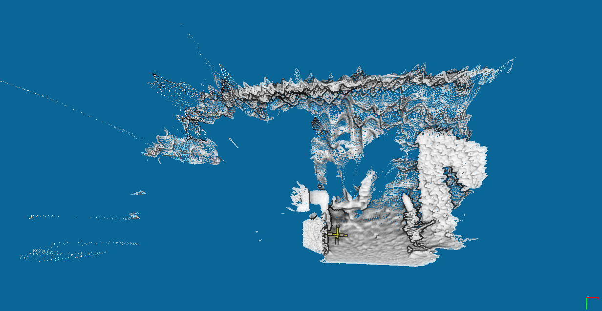

This repository contains:
- A C++ ground annotator of point clouds based on: 
	Fast segmentation of 3D point clouds: a paradigm on LIDAR data 
	By Dimitris Zermas Izzat Izzat and Nikolas Papanikolopoulos
```
@inproceedings{7989591, 
	author={D. Zermas and I. Izzat and N. Papanikolopoulos}, 
	booktitle={2017 IEEE International Conference on Robotics and Automation (ICRA)}, 
	title={Fast segmentation of 3D point clouds: A paradigm on LiDAR data for autonomous vehicle applications}, 
	year={2017}, 
	pages={5067-5073}, 
	doi={10.1109/ICRA.2017.7989591}, 
	ISSN={}, 
	month={May}
}

```

## Prerequisites

```
For the ground extraction algorithm (C++)
- Eigen3
- Boost
- Librealsense 2.0
```

## Process (example)

### 1. Ground Annotator

Compile

```
mkdir & cd build
cmake ..
make 
```

To test if it works, run the following command:
```
cd $CUCO_ROOT/build
./cuco
```
It should create a folder called ```pointcloudx``` in ```./tests/``` where it will save the annotated point clouds. 

Modifying parameters:
```
cd $CUCO_ROOT/build
./cuco --outpath ../tests/ --n 10 --thseed 0.5 --lha 20 
```
Those are my prefered parameter values. However, if not modified, it will use the default values based on the original implementation. Check either the paper or the code to see what each parameter does. 

#### Some results (so far)
<p align="center">
    
  </p>

## TO DO:
- [ ] Pointcloud sorting
- [ ] Ground extraction algorithm 
