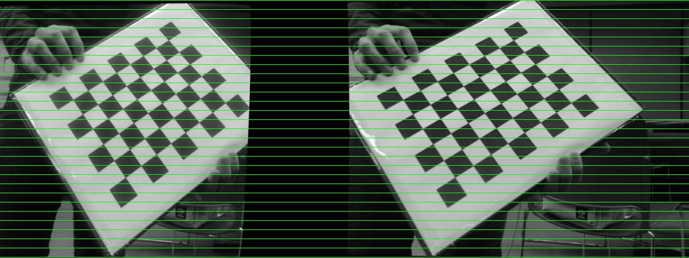
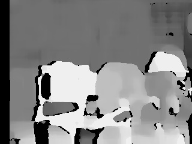

### Computer Vision and A.I. - VantTEC

# Vision Stereo y Calibracion de Camaras

### Referencias

 stereo_match.cpp
 calibration
 Created by Victor  Eruhimov on 1/18/10.
 Copyright 2010 Argus Corp. All rights reserved.

## Calibracion de Stereo Camaras

Implementación de sistema de vision stereo para calculo de distancias.

### Requisitos

OpenCV 3.1
Dos Camaras Web

### Correr
*Asegurarse que todas las funciones automaticas de las camas web esten desabilitadas
Si se utiliza Webcam Logitec 920C
```
v4l2-ctl --list-devices
v4l2-ctl --device=2 -l
v4l2-ctl --device=2 --set-ctrl=focus_auto=0
v4l2-ctl --device=2 --set-ctrl=exposure_auto=1
v4l2-ctl --device=1 --set-ctrl=exposure_auto_priority=0
```
###Correr:
```
cmake .
make image_cap
make stereo_calib
make stereo_match
```

Tomar fotografias para calibrar camaras. 
```
./image_cap.cpp
```
Creas lista de imagenes:
*lista debe de estar derecha - izquierda - derecha - izquierda
```
./imagelist_creator.cpp stereo_calib.xml *.jpg
```

### Rectificación:
Dentro de la carpeta calibración, ejecutar:
```
./stereo_calib -w=8 -h=6  stereo_calib.xml
```
-w= # de esquianas de adentro de ancho
-h= # de esquinas de adentro de altura
lista de imagenes para calibración: stereo_calib.xml

<p align="center"> </p>


### Disparity map
```
./stereo_match --intrinsics=intrinsics.yml --extrinsics=extrinsics.yml --leftImageP=lefttest.jpg --rightImageP=righttest.jpg
```
<p align="center"> </p>


