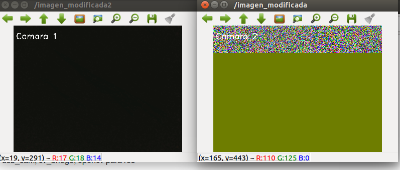

# Nodo suscrito a 2 camaras

### Prerequisitos

Instalar los paquetes de image_view, usb_cam, cv_bridge, opencv para ros

```
sudo apt-get install ros-kinetic-opencv3
sudo apt-get install ros-kinetic-usb-cam
sudo apt-get install ros-kinetic-image-view
sudo apt-get install ros-kinetic-cv-bridge

```

### Modificar entrada de las camaras
Para modificar la entrada de las camaras cambias el valor de video_device en los nodos usb_cam, en el archivo .launch

```
<param name="video_device" value="/dev/video1"/>
```

### Ejecutar Nodo

En el ambiente catkin:

1.Se ejecuta el archivo launch en la carpeta launch

```
roslaunch camara_launch.launch

```

2.Se ejecuta el nodo nodo_camaras_ros_cv.py en la carpeta scripts

```
python nodo_camaras_ros_cv.py

```
3.El resultado es el siguiente:
<p align="center"> </p>

